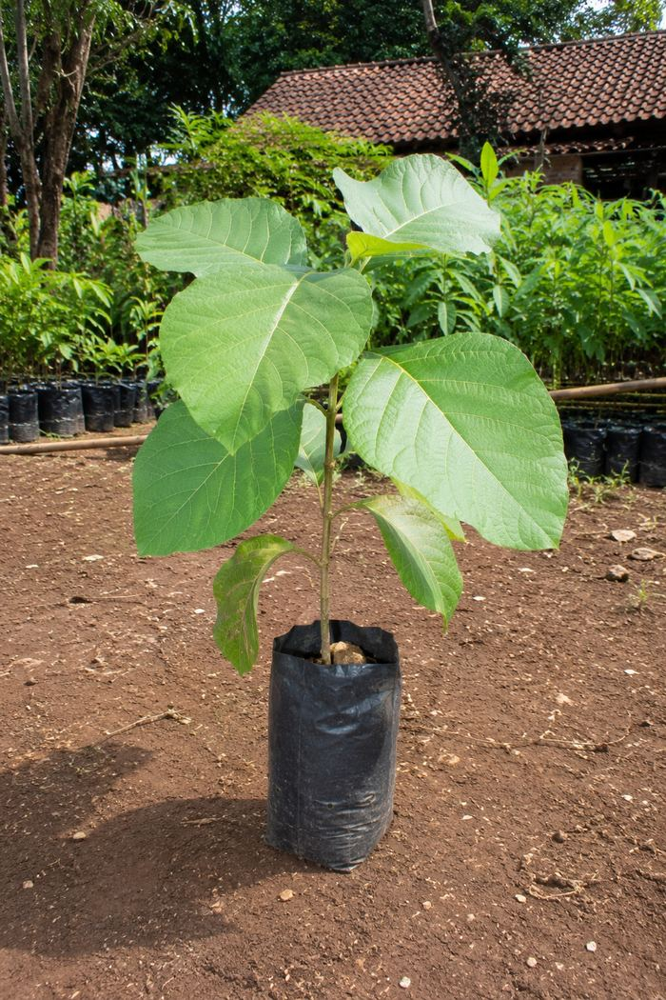

# Khanza Bibit — Landing Page

Landing page untuk **Khanza Bibit**, penjual bibit tanaman kayu, buah-buahan, hias, dan rempah-rempah di Kec. Kemiri, Purworejo.

Website statis (HTML/CSS/JS murni, tanpa framework/build tool) — jadi bisa langsung di-deploy tanpa konfigurasi ribet.

---

## 📁 Struktur Folder

```
khanza-bibit-web/
├── index.html           ← struktur halaman (HTML saja)
├── css/
│   └── style.css         ← semua styling
├── js/
│   └── script.js         ← filter katalog & menu mobile
├── images/               ← semua foto & logo
│   ├── logo.png
│   ├── alpukat-sab034.jpg
│   ├── alpukat-black-avocado.jpg
│   ├── alpukat-ta21.jpg
│   ├── alpukat-closeup.jpg
│   ├── durian-duri-hitam.jpg
│   ├── kakao.jpg
│   ├── pucuk-merah.jpg
│   ├── pucuk-merah-kebun.jpg
│   └── palem-kipas.jpg
└── README.md             ← file ini
```

---

## 🚀 Cara Upload ke GitHub

1. Buat repository baru di GitHub (public atau private, bebas), misal nama `khanza-bibit-web`
2. Di komputer, masuk ke folder `khanza-bibit-web` ini lalu jalankan:
   ```bash
   git init
   git add .
   git commit -m "Landing page Khanza Bibit"
   git branch -M main
   git remote add origin https://github.com/USERNAME/khanza-bibit-web.git
   git push -u origin main
   ```
   *(ganti `USERNAME` dengan username GitHub Anda)*
3. Atau lebih gampang: buka repo baru di GitHub → tombol **"uploading an existing file"** → drag & drop semua isi folder ini (termasuk folder `images`)

---

## ▲ Cara Deploy ke Vercel

1. Buka [vercel.com](https://vercel.com) → login (bisa pakai akun GitHub)
2. Klik **"Add New Project"**
3. Pilih repo `khanza-bibit-web` yang sudah di-push tadi
4. Di bagian **Framework Preset**, pilih **"Other"** (karena ini HTML statis, bukan React/Next.js)
5. Build Command & Output Directory — **kosongkan saja / biarkan default**, tidak perlu diisi
6. Klik **Deploy**
7. Setelah selesai (biasanya <1 menit), Vercel kasih link seperti `khanza-bibit-web.vercel.app` — itu sudah live dan bisa dibuka publik

### Custom Domain (opsional)
Kalau nanti mau pakai domain sendiri (misal `khanzabibitpurworejo.com`):
1. Beli domain di penyedia manapun (Niagahoster, Rumahweb, Namecheap, dll)
2. Di dashboard Vercel → project ini → tab **Settings → Domains** → masukkan domain Anda
3. Vercel kasih instruksi DNS (CNAME/A record) yang tinggal dimasukkan ke pengaturan domain

---

## ✏️ Status Katalog

Katalog sekarang berisi **27 produk** di 4 kategori, semua sudah ada foto:

| Kategori | Jumlah | Produk |
|---|---|---|
| Buah-buahan | 9 | Alpukat SAB 034, Alpukat Black Avocado, Alpukat TA-21, Durian Duri Hitam, Kakao, Manggis, Duku, Kelengkeng, Jambu Kristal |
| Tanaman Hias | 5 | Pucuk Merah, Palem Kipas, Sadang, Aglonema, Kamboja Jepang (Adenium) |
| Tanaman Kayu | 6 | Jati, Albasia, Sonokeling, Mahoni, Trembesi, Waru |
| Rempah-rempah | 7 | Daun Salam, Kemangi, Jahe, Mint, Lengkuas, Kunyit, Serai |

**Penting:** Sebagian foto (terutama kategori Kayu, Rempah, dan beberapa Buah/Hias tambahan) adalah **foto ilustrasi hasil AI**, bukan foto asli dari kebun Khanza — dipakai sementara sampai ada foto asli. Kalau ada produk yang **stoknya habis / tidak dijual**, tinggal hapus kartunya (lihat cara di bawah), atau kabari saya untuk dihapuskan.

| Bagian | Status | Catatan |
|---|---|---|
| Testimoni pelanggan | ⚠️ Masih contoh | Cari di `index.html`, bagian `<!-- TESTIMONI -->` |
| Harga & stok | ✅ Sengaja tidak dicantumkan | Karena fluktuatif — arahnya ke chat WhatsApp |
| Favicon & preview link (Open Graph) | ✅ Sudah aktif | Pakai `images/favicon.png` dan `images/banner.jpg` |

### Cara ganti foto placeholder jadi foto asli
Contoh untuk bibit **Jati**, cari di `index.html` bagian ini:
```html
<div class="produk-img placeholder">
  <span class="produk-hole"></span>
  <span class="ph-label">Foto<br>Menyusul</span>
</div>
```
Ganti jadi:
```html
<div class="produk-img">
  <span class="produk-hole"></span>
  
</div>
```
Lalu taruh file foto `jati.jpg` di folder `images/`.

### Cara menghapus produk yang stoknya habis / tidak dijual
Cari nama produknya di `index.html` (pakai Ctrl+F / Cmd+F), lalu hapus seluruh blok dari:
```html
<div class="produk" data-cat="...">
```
sampai penutupnya:
```html
</div>
```
*(satu blok utuh mewakili satu kartu produk)*

### Cara ganti nomor WhatsApp
Nomor WA (`6282224415565`) muncul berkali-kali di `index.html` dalam bentuk link `https://wa.me/6282224415565?text=...`. Gunakan fitur **Find & Replace** di text editor untuk ganti semua sekaligus kalau nomornya berubah.

### Cara edit warna / tampilan
Semua warna diatur lewat CSS variables di baris paling atas `css/style.css`, contoh:
```css
:root{
  --pine: #33503A;   /* hijau utama */
  --ochre: #BD8127;  /* aksen buah */
  --paprika: #AE4B29; /* aksen rempah */
}
```
Ganti kode warnanya di situ saja, otomatis berubah di seluruh halaman.

### Cara edit interaksi (filter katalog, menu mobile)
Ada di `js/script.js` — logikanya simpel, tidak pakai library apapun (vanilla JavaScript).

---

## 🎨 Tentang Desain

- **Warna & font**: tema "kertas kebun" — krem, hijau pinus, aksen ochre/paprika sesuai kategori produk (kayu=hijau, buah=kuning, hias=hijau lumut, rempah=merah)
- **Elemen khas**: kartu produk dibuat menyerupai label gantung bibit (nursery tag) — sesuai kebiasaan Khanza yang selalu memberi label pada tiap bibit
- Semua tombol "Tanya via WA" otomatis membuka WhatsApp dengan pesan yang sudah terisi nama produk

---

## 📍 Info Bisnis (tercantum di web)

- **Nama**: Khanza Bibit
- **Alamat**: Ngemplak RT 02 / RW 02, Desa Samping, Kec. Kemiri, Kabupaten Purworejo, Jawa Tengah 54262
- **WhatsApp**: 0822-2441-5565
- **TikTok**: [@teguh.wibowo561](https://www.tiktok.com/@teguh.wibowo561)
- **Google Maps**: [Lihat lokasi](https://maps.app.goo.gl/UqwznX7Ne4UvaN2a9)
- **Rating**: 4.9 ⭐ dari 12 ulasan (Google Maps) — *cek berkala, ada 11 ulasan baru menunggu masuk resmi ke Maps*
